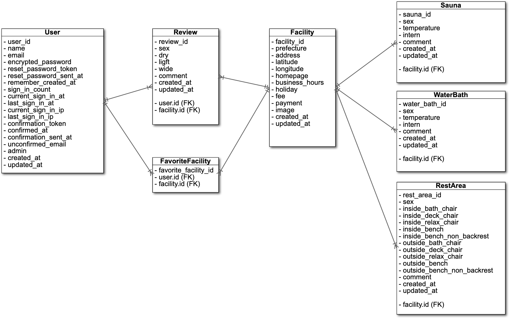
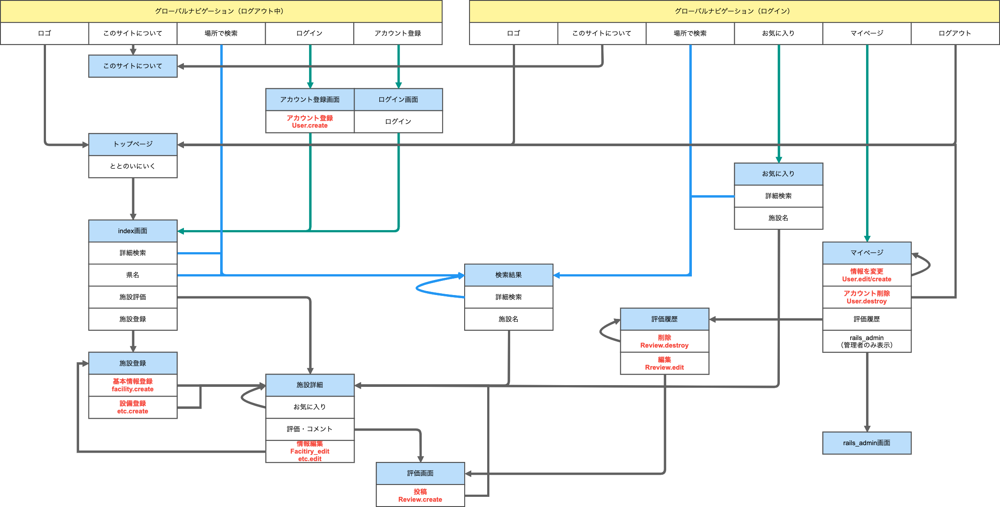

## README
#### 開発言語
- Ruby 2.6.5
- Rails 5.2.6

#### 就業Termの技術
- devise
- お気に入り機能

#### カリキュラム外の技術
- gem 'dotenv-rails' 環境変数の管理用
- gem 'geocoder' 住所を緯度経度に変換
- gem 'gmaps4rails' 緯度経度からgoogleMAPを表示
- gem 'cocoon' 動的な入力フォームの追加
- gem 'ransack' 検索機能

#### 実行手順
$ git clone git@github.com:Hibasan/Rails-totonoi_spot.git

$ cd Rails-totonoi_spot

$ bundle install

$ rails db:create db:migrate db:seed

#### カタログ設計
[https://docs.google.com/spreadsheets/d/1BJqi-Fyw4CwpUQTP6jIA0IgOnmZ-ENGksapskTtDR6k/edit?usp=sharing](https://docs.google.com/spreadsheets/d/1BJqi-Fyw4CwpUQTP6jIA0IgOnmZ-ENGksapskTtDR6k/edit?usp=sharing)

#### テーブル定義書
[https://docs.google.com/spreadsheets/d/1BJqi-Fyw4CwpUQTP6jIA0IgOnmZ-ENGksapskTtDR6k/edit?usp=sharing](https://docs.google.com/spreadsheets/d/1BJqi-Fyw4CwpUQTP6jIA0IgOnmZ-ENGksapskTtDR6k/edit?usp=sharing)

#### ワイヤーフレーム
[https://cacoo.com/diagrams/R7yZ1r7o1VkmqkTx/02047](https://cacoo.com/diagrams/R7yZ1r7o1VkmqkTx/02047)

#### ER図

#### 画面遷移図

