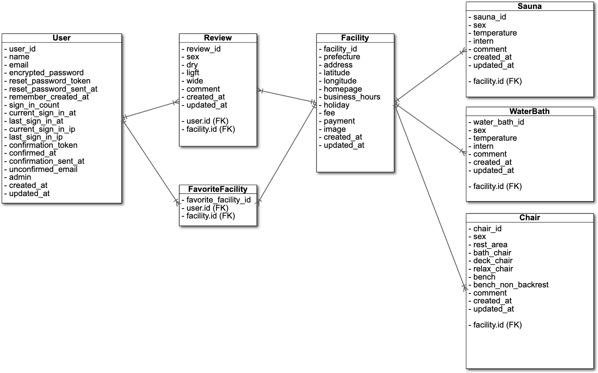

## README
#### コンセプト
  サウナ、クールダウン環境に特化した(したい)サイト 『ととのいスポット』 略称 ととスポ
  サウナの湿度！？水風呂？？それより俺はゆっくり休憩がしたいんだ！！！
  クールダウン環境が設けられているサウナ施設のみ登録しています

#### 開発言語
- Ruby 2.6.5
- Rails 5.2.6

#### 就業Termの技術
- devise
- お気に入り機能(ajax)

#### カリキュラム外の技術
- gem 'geocoder' 住所を緯度経度に変換
- gem 'gmaps4rails' 緯度経度からgoogleMAPを表示

#### 使用Gem
- gem 'devise'
- gem 'rails_admin'
- gem 'cancancan'
- gem 'jquery-rails'
- gem 'cocoon'
- gem 'ransack'
- gem 'geocoder'
- gem 'gmaps4rails'
- gem 'bootstrap'
- gem 'carrierwave'
- gem 'mini_magick'
- gem 'kaminari'

#### 実行手順
$ git clone git@github.com:Hibasan/Rails-totonoi_spot.git

$ cd Rails-totonoi_spot

$ bundle install

$ rails db:create db:migrate db:seed

#### カタログ設計
[https://docs.google.com/spreadsheets/d/1BJqi-Fyw4CwpUQTP6jIA0IgOnmZ-ENGksapskTtDR6k/edit?usp=sharing](https://docs.google.com/spreadsheets/d/1BJqi-Fyw4CwpUQTP6jIA0IgOnmZ-ENGksapskTtDR6k/edit?usp=sharing)

#### テーブル定義書
[https://docs.google.com/spreadsheets/d/1BJqi-Fyw4CwpUQTP6jIA0IgOnmZ-ENGksapskTtDR6k/edit?usp=sharing](https://docs.google.com/spreadsheets/d/1BJqi-Fyw4CwpUQTP6jIA0IgOnmZ-ENGksapskTtDR6k/edit?usp=sharing)

#### ワイヤーフレーム
[https://cacoo.com/diagrams/R7yZ1r7o1VkmqkTx/02047](https://cacoo.com/diagrams/R7yZ1r7o1VkmqkTx/02047)

#### ER図

#### 画面遷移図

